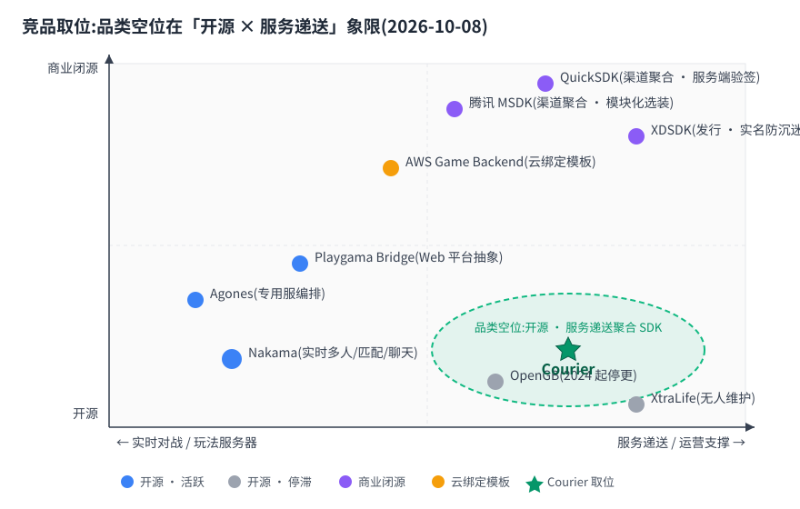

# 竞品调研:Courier 的取位与边界

> 数据口径:GitHub 星数/活跃度经 GitHub API 核查,**截至 2026-10-08**;商业产品以官方文档为准。本文只做盘点与推论,不做背书;链接随论断给出,失效请提 issue。

## 一句话结论

「跨引擎客户端 SDK + 服务递送聚合」这个品类在开源世界是空位:开源强在游戏服务器(Nakama),商业强在渠道聚合(MSDK/QuickSDK/XDSDK),**没有人把「账号 + 公告 + 客服 + 支付 + 合规 + 配置」当作跨引擎统一契约来管**。Courier 取这个位;同时明确不做实时多人/匹配与渠道聚合。

## 开源直接对标

> **结论先行:开源阵营没有「服务型聚合 SDK」——最近的 Nakama 是另一个物种,其余要么停滞要么绑云。**

| 项目 | 定位 | 星数 | 活跃度(最后推送) | 与 Courier 的差异 |
| --- | --- | --- | --- | --- |
| [Nakama](https://github.com/heroiclabs/nakama) | 开源游戏服务器(实时多人/匹配/排行榜/聊天/社交) | 13,478 | 2026-09(活跃,Go,Apache-2.0) | 它是**一整套服务器**;Courier 是客户端 SDK + 轻网关,不碰实时多人/匹配 |
| [Open Game Backend(OpenGB)](https://github.com/OpenGameBackend/OpenGameBackend) | 模块化可脚本化游戏后端(TypeScript,Rivet 系) | 主仓 2;插件 57/10/5 | 2024-11 起停更;[Rivet 侧已 archived](https://github.com/rivet-dev/toolchain) | 方向相近但已停滞/被吸收——品类的反面教材 |
| [XtraLife](https://github.com/xtralifecloud/xtralife-server) | 开源游戏 BaaS(前身 Clan of the Cloud,Node.js) | 5 | 2024-10(零星),org 多数仓 2016–2022 停更 | 用户/存储/货币型 BaaS,无公告/客服/合规面;事实上无人维护 |
| [Playgama Bridge](https://github.com/Playgama/bridge)([Unity 版](https://github.com/Playgama/bridge-unity)) | HTML5 游戏一键发 20+ web 平台的平台抽象 SDK | 121 / 56 | 2026-10(活跃,TS/LGPL、C#/MIT) | 抽象的是「**发布平台**」(Poki/CrazyGames/Yandex),Courier 抽象的是「**游戏服务后端**」;Web 桥 ≠ 通用服务 SDK |
| [AWS Game Backend Framework](https://github.com/aws-solutions-library-samples/guidance-for-custom-game-backend-hosting-on-aws) | AWS 托管服务组合的后端模板(Cognito/AppSync/DynamoDB 等 Guidance) | 60 | 2026-08 | 云绑定的基础设施模板,非引擎 SDK;Courier 云中立、SDK 优先 |

### Nakama:最近的邻居,不同的物种

Nakama 是这个领域质量最高的开源项目,值得尊重也有明确边界:

- 它的核心价值是**服务器能力**(实时多人、匹配、排行榜、聊天),客户端 SDK 是其服务器的接入层。
- 账号体系绑定 Nakama 自身服务器;公告、客服工单、支付递送、实名合规、远程配置不在其能力面。
- Courier 的核心价值是**客户端契约与能力编排**:Gateway 只是契约的实现者,后端可整体替换。两者可共存(游戏用 Nakama 做对战服,用 Courier 做账号/公告/客服/支付递送),不互斥。

## 商业参照(闭源,看方向不看代码)

> **结论先行:商业聚合证明了需求真实,且共同趋势是「模块化选装 + UI 剥离给游戏 + 合规内置」——三条都与 Courier 设计互相印证。**

| 产品 | 切入点 | 对 Courier 的启示 |
| --- | --- | --- |
| [腾讯 MSDK](https://docs.msdk.qq.com/) | 登录渠道(WeChat/QQ/Facebook/GameCenter/GooglePlay)、支付、Bugly 等全部**插件化按需选装**(GCloud 管理端下载时选模块,见[模块说明](https://docs.msdk.qq.com/v5/zh-CN/Module/Modules.html)、[PC 接入](https://docs.msdk.qq.com/v5/zh-CN/Access/PC.html)) | 「按需选装」验证了 Courier 的 Provider/可选包设计;商业聚合证明了需求真实存在 |
| [QuickSDK](https://www.quicksdk.com/) | 国内手游渠道聚合(登录+充值),联运发行方案;强调服务端 token 验证防伪造 | 渠道聚合是发行侧生意,Courier 不做;但「客户端拿到的凭证必须服务端验证」的安全口径一致 |
| [XDSDK](https://sdk-docs.xindong.com/anti-addiction)([文档中心](https://xindong.github.io/XDSDK-Doc/),[PC SDK](https://github.com/xd-platform/XDSDK-UE-PC)) | TapTap 登录/支付;实名防沉迷模块(v6.4.0 起剥离,指向 [TapSDK 合规认证](https://developer.taptap.cn/docs/v3/sdk/anti-addiction/guide),分「已有版号/暂无版号」方案) | 两条:①实名防沉迷是国内 SDK 的**必备合规项**(印证 Courier RealName 的必要性);②登录 UI 由游戏自绘、SDK 剥离 UI 的趋势,与 Courier「UI 永远可选」的口径一致 |

## 三条结论

**1. 品类有空位:开源没有「服务型聚合 SDK」。**
开源阵营里,Nakama 管服务器,OpenGB/XtraLife 已停滞或无人维护,AWS 方案绑云——没有人把「账号 + 公告 + 客服 + 支付递送 + 合规 + 远程配置」作为跨引擎客户端统一契约来经营。商业聚合(MSDK/QuickSDK/XDSDK)闭源、绑渠道、绑发行体系,不服务自建后端的团队。Courier 取位:开源的「服务递送聚合 SDK」,后端 Provider 开放可换。

**2. 抄两点:Nakama 的多引擎工程实践 + MSDK 的插件化选装。**
Nakama 值得抄的是工程面:每个引擎一等公民、示例与文档齐平、契约行为跨端一致(这正是 Courier M0 立宪要保证的)。MSDK 值得抄的是产品面:功能全部插件化、按需选装、可拆可删(与 Courier「Provider 可换可关 + UI/Diagnostics 可选包」同一哲学,互相印证)。

**3. 边界:实时与渠道,不做。**
实时多人/匹配/大厅服务器是 Nakama / Agones 的地盘,Courier 不碰;渠道包聚合联运是 MSDK / QuickSDK / XDSDK 的地盘,Courier 不碰。Courier 是「玩家世界与游戏服务生态之间的门」:服务递送层。这条边界同时写进 [roadmap 非目标](../roadmap.md)。

## 可参考分析

> **结论先行:9 个对标对象里 6 条可参考/可借鉴(全部已或将有本仓落点),3 条不适用(边界佐证)。**

| 对象/做法 | 判定 | 为什么 | 落到本仓哪里 |
| --- | --- | --- | --- |
| Nakama 的多引擎工程实践(每引擎一等公民、契约行为跨端一致) | ✅ 可参考 | 「跨端一致」是本品类最稀缺的承诺,Nakama 证明了它在开源世界可维护 | 五层架构与 L1 契约测试骨架(`tools/contractgen` 六端生成、漂移即测试红,[todo 批次 1](../todo.md) 已落地);各端 Adapter 按批次推进 |
| Nakama 实时多人/匹配/大厅/聊天 | ⬜ 不适用 | 玩法服务器能力,Courier 定位是服务递送层;做进去就是第二个 Nakama | [roadmap 非目标](../roadmap.md)(已登记,维持) |
| OpenGB 的模块化可脚本化后端 | ⚠️ 可借鉴(反面) | 方向与 Courier 最接近却停滞、被 Rivet 吸收——教训:**先冻结契约、小核心大生态**,否则插件仓失焦 | M0「契约先行」(实现动工前基元+auth+M2 三域已冻结);Provider 接口形状批次 2 冻结而非开放生长 |
| XtraLife 开源 BaaS | ⬜ 不适用 | 无公告/客服/合规面且事实上停止维护,无工程可抄 | —(仅作品类停滞旁证) |
| Playgama Bridge 的 20+ 平台适配组织 | ⚠️ 可借鉴 | 它抽象「发布平台」、Courier 抽象「服务后端」,是两个品类;但其「平台差异全部压进一层适配」的组织方式值得镜鉴 | L3 Adapter 边界([layers.md](../layers.md)):平台差异只进 Adapter,Core 不碰平台(packcheck 结构验收守) |
| AWS Game Backend Framework | ⬜ 不适用 | 云绑定基础设施模板,与「云中立、SDK 优先」定位相反 | —(反衬云中立原则;Gateway/Provider 不绑云) |
| MSDK 插件化按需选装 | ✅ 可参考 | 商业聚合验证了「不为用不到的功能付体积」是真实付费需求 | Provider 可换可关原则 + UPM 三包(core/service/ui,[todo 批次 5](../todo.md) 已落位);Diagnostics/UI 永远可选 |
| QuickSDK 的服务端 token 验签口径 | ✅ 可参考 | 「客户端凭证不可信、必须服务端验证」跨品类成立(登录凭证与支付收据同理) | [auth.md](../contract/auth.md) Token 模型(Bearer+轮换+吊销,已冻结);支付收据验真留 M5 契约落点 |
| XDSDK 实名防沉迷(模块剥离给 TapSDK) | ✅ 可参考 | 国内合规是上架硬门槛,「实名做成默认路径而非扩展模块」被头部发行验证 | [realname.md](../contract/realname.md) 契约 + [todo 批次 7](../todo.md) 热插拔/降级链/熔断;红线(默认关、开启明示数据范围)已写进契约宪法 |
| XDSDK/MSDK 的登录 UI 剥离趋势 | ✅ 可参考 | 递送型 SDK 不该绑 UI 是行业共同走向 | `com.courier.ui` 独立可选包;Core 无品牌逻辑、无强制 UI(layers.md L2/L3 边界) |
